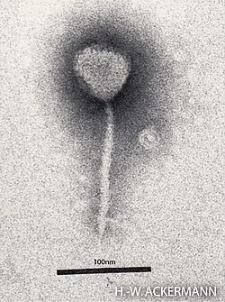
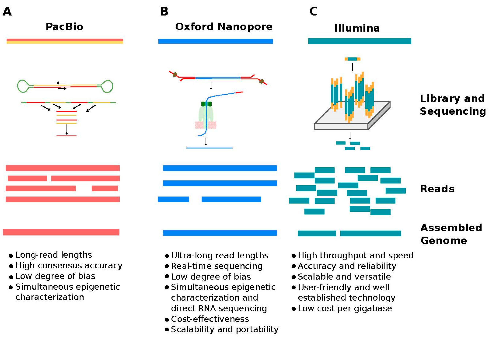
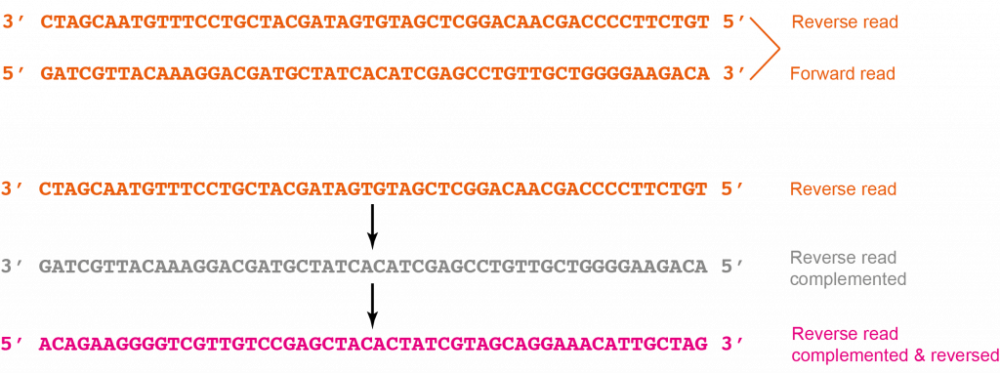
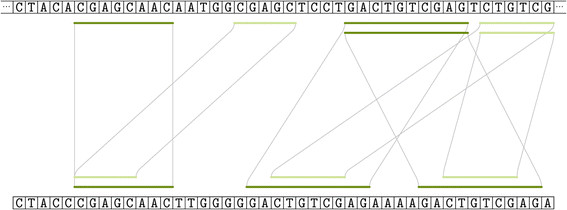
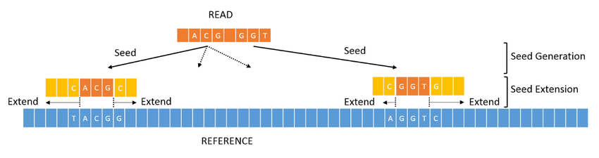
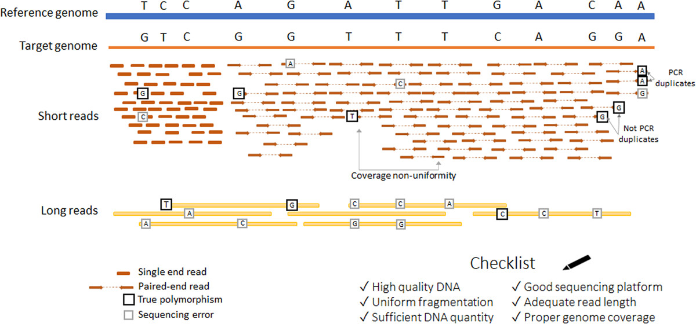
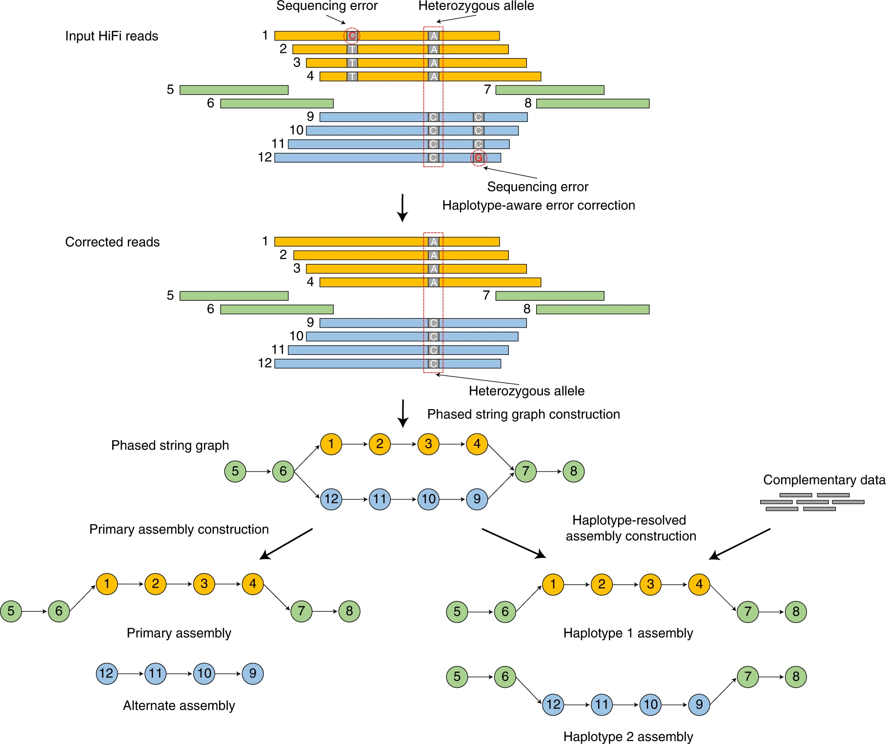
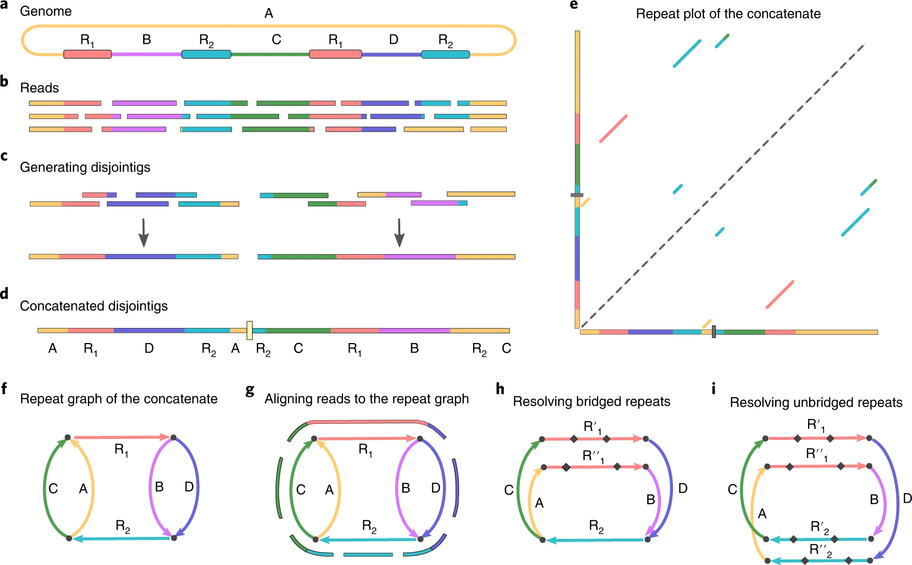

# Lezione 2

## Introduzione

In questa lezione vedremo i tool principali di una pipeline che parte dal sequenziamento, assembla un reference, simula delle read, allinea queste read e fa il variant calling.

## Ambiente

Se ancora non avete installato _mamba_ provate ad installare ora [micromamba](https://mamba.readthedocs.io/en/latest/installation/micromamba-installation.html)

Primo step creiamo un ambiente conda per questa lezione:

```shell
mamba create -n lab -c conda-forge -c bioconda seqtk wgsim minimap2 samtools bcftools hifiasm flye badread quast wget gzip ropebwt3 bwa -y
```

Attiviamo l'ambiente:

```shell
mamba activate lab
```

## Dati

Per questa lezione useremo dati ovviamente molto piccoli.
Come reference usiamo il [Lambda Phage](https://en.wikipedia.org/wiki/Lambda_phage), Fago Lambda in italiano, che è un batteriofago che infetta Escherichia coli (grazie Wikipedia):



Come abbiamo visto l'altro giorno sul sito dell'NCBI troviamo tantissimi dati pubblici di tantissimi organismi o meno (non mi spingo in discussioni filosofiche su cosa siano i virus).
Se lo cerchiamo arriviamo a questo [link](https://www.ncbi.nlm.nih.gov/search/all/?term=Lambda%20Phage) dove abbiamo 3 genomi assemblati.
Prendiamo il più aggiornato, ovvero [questo](https://www.ncbi.nlm.nih.gov/datasets/genome/GCA_035764635.1/) e scarichiamo il genoma:

```shell
wget https://ftp.ncbi.nlm.nih.gov/genomes/all/GCA/035/764/635/GCA_035764635.1_ASM3576463v1/GCA_035764635.1_ASM3576463v1_genomic.fna.gz --output-document lambda.fa.gz
```

Lo decomprimiamo:

```shell
gzip -h
gzip -dk lambda.fa.gz
```

Vediamo cosa abbiamo scaricato:

```shell
most lambda.fa
```

Controlliamo di avere una sola sequenza:

```shell
grep --help
grep ">" lambda.fa -c
```

## Short-read e long-read

Un'immagine presa da:

```
Ermini, Luca, and Patrick Driguez. "The application of long-read sequencing to cancer." Cancers 16.7 (2024): 1275.
```



## Simulazione short-read

Il prossimo step è quello di simulare delle short-read da usare per l'allineamento.
Il tool che useremo è wgsim, disponibile su [github](https://github.com/lh3/wgsim), il primo tool di Heng Li che vedremo oggi. Come vedete dal README, dal codice e dall'help è un simulatore molto basilare.

```shell
wgsim -h
```

Generiamo quindi un numero piccolo di read, diciamo 10000 lunghe 100, con un rateo di errore dell'1% e di mutazioni del 0.5%. Questo simulatore genera 2 file con le read (10000 per file).
Vediamo [qui](https://www.illumina.com/science/technology/next-generation-sequencing/plan-experiments/paired-end-vs-single-read.html) una breve spiegazione del concetto di read paired-end.

Generiamo quindi le read, la distanza di default è 500:

```shell
wgsim -N 10000 -e 0.01 -r 0.005 -1 100 -2 100 lambda.fa short_read1.fq short_read2.fq
```

Vediamo i due file e controlliamo di avere effettivamente 10000 reads in ciascun file:

```shell
most short_read1.fq
most short_read2.fq
grep "@" short_read1.fq -c
grep "@" short_read2.fq -c
diff short_read1.fq short_read2.fq
```

## Simulazione long-reads

In ottica assemblaggio possono tornare più comode le long read.
Per simularle usiamo ad esempio badread, disponibile su [github](https://github.com/rrwick/Badread). Vediamo per prima cosa README e help:

```shell
badread -h
badread simulate -h
```

Come vediamo è un tool più specifico e possiamo scegliere come modello per gli errori direttamente il metodo di sequenziamento reale.
Simuliamo read con una buona depth, diciamo 10x (avremmo potuto usare anche qui il numero di read, 10x è poco ma non vogliamo friggere i pc), sono long-read quindi lunghe di media 10000 (con stdev di 2000):

```shell
badread simulate --reference lambda.fa --quantity 10x --length 10000,2000 > long_read.fq
```

Anche qui facciamo qualche controllo basilare:

```shell
most long_read.fq
grep "@" long_read.fq -c
```

## Analisi delle read

Un tool molto usato per interfacciarsi con fasta e fastq è seqtk, disponibile su [github](https://github.com/lh3/seqtk) e sempre sviluppato da Heng Li.
Vediamo i sottocomandi disponibili:

```shell
seqtk
```

Possiamo passare da fastq a fasta (perdendo ovviamente informazione della qualità):

```shell
seqtk seq
seqtk seq -A short_read1.fq | most
```

Possiamo generare i reverse-and-complement:



```shell
seqtk seq -r short_read1.fq | most
```

Possiamo vedere la qualità delle read:

```shell
seqtk fqchk short_read1.fq | most
seqtk fqchk short_read2.fq | most
seqtk fqchk long_read.fq | most
```

Breve spiegazione:

| Colonna     | Significato                                                        |
| :---------- | :----------------------------------------------------------------- |
| **pos**     | Posizione del nucleotide. L'ultima riga è "ALL" (Totale).          |
| **bases**   | Numero totale di sequenze lette in quella posizione.               |
| **A,C,G,T** | Frequenza percentuale dei singoli nucleotidi.                      |
| **N**       | Percentuale di basi non identificate dal sequenziatore.            |
| **avgQ**    | Qualità media (Phred Score) in quella posizione.                   |
| **errQ**    | Tasso di errore stimato (calcolato matematicamente dal Q-Score).   |
| **%low**    | Percentuale di basi di bassa qualità (Q < 20) in quella posizione. |

## Pattern-Matching

Per ricollegarci velocemente anche al corso di Teoria Della Computazione vediamo ropebwt3, disponibile su [github](https://github.com/lh3/ropebwt3), un'implementazione estremamente efficiente della BWT e dell'FM-index, sempre sviluppata da Heng Li.
Vediamo README e help:

```shell
ropebwt3
```

Per prima cosa bisogna costruire l'indice:

```shell
ropebwt3 build
ropebwt3 build -do lambda.fmd lambda.fa
```

Possiamo vedere quanto sia leggero e qualche breve statistica:

```shell
ls -lh lambda.fmd
ropebwt3 stat -m lambda.fmd
```

In termini di pattern-matching calcoliamo i super-maximal exact matches. Senza entrare nei formalismi, usiamo questa immagine presa da questo [paper](https://pmc.ncbi.nlm.nih.gov/articles/PMC4449525/) di Vyverman et al.:



Computiamo gli smem:

```shell
ropebwt3 mem -t 2 lambda.fmd short_read1.fq > exact_matches.txt
most exact_matches.txt
```

## Allineamento short-read

Vediamo ora come effettivamente allineare le nostre short read al reference.
Usare una programmazione dinamica pura sarebbe troppo costoso quindi solitamente si usa il paradigma _seed-and-extend_, [qui](https://www.researchgate.net/publication/366327922_GPU_Acceleration_of_BWA-MEM_DNA_Sequence_Alignment) ben rappresentato:



Useremo minimap2, disponibile su [github](https://github.com/lh3/minimap2), sempre sviluppato da Heng Li e successore di [bwa - Burrow-Wheeler Aligner](https://github.com/lh3/bwa) per funzionare anche con long-reads. Mentre bwa usa la BWT, minimap2 si basa sui minimizer.

Come sempre prima vediamo README e help:

```shell
minimap2 --help
```

E allineiamo, usando il preset adeguato, gli score di penalità di default e scrivendo il risultato in un file SAM:

```shell
minimap2 -a -x sr lambda.fa short_read1.fq short_read2.fq > short_align.sam
```

Gurdiamo il risultato e vediamo quanti allineamenti abbiamo:

```shell
most short_align.sam
grep -v "@" short_align.sam -c
```

Sempre Heng Li ci fornisce anche samtools, disponibile su [github](https://github.com/samtools/samtools), che fornisce tutta una serie di sottocomandi per interagire con i file SAM.

In primis possiamo vedere qualche statistica:

```shell
samtools flagstat short_align.sam | most
```

| Metrica             | Significato                                                                       |
| :------------------ | :-------------------------------------------------------------------------------- |
| **in total**        | Numero totale di read (frammenti) presenti nel file BAM.                          |
| **mapped**          | Read che si sono allineate con successo al genoma (il target è > 95%).            |
| **properly paired** | Coppie di read allineate perfettamente (orientamento e distanza corretti).        |
| **singletons**      | Solo una read della coppia si è allineata, mentre l'altra ("mate") ha fallito.    |
| **duplicates**      | Read identiche sovrapposte, spesso artefatti di PCR (idealmente un numero basso). |

Anche più complete:

```shell
samtools stats short_align.sam | most
```

Possiamo poi produrre il formato binario (BAM), molto più leggero:

```shell
samtools view -b short_align.sam > short_align.bam
ls -lh short_align.*
samtools view short_align.bam | most
```

Come introdotto l'altra volta, un SAM/BAM può essere indicizzato per rendere l'accesso più veloce. Serve prima sortarlo:

```shell
samtools sort short_align.bam > short_align_sorted.bam
diff <(samtools view short_align_sorted.bam) short_align.sam -y | most
samtools index short_align_sorted.bam
```

Possiamo farci un'idea del risultato dell'allineamento in modo visivo:

```shell
samtools mpileup
samtools mpileup -f lambda.fa short_align_sorted.bam | most
```

| Colonna | Nome       | Significato                                                               |
| :------ | :--------- | :------------------------------------------------------------------------ |
| **1**   | Cromosoma  | Nome della sequenza di riferimento (es. `NC_001416.1`).                   |
| **2**   | Posizione  | Coordinata esatta sul genoma di riferimento.                              |
| **3**   | Ref Base   | La base originale attesa in quel punto.                                   |
| **4**   | Profondità | Numero totale di read che si sovrappongono in questa posizione.           |
| **5**   | Read Bases | Le basi effettivamente lette dalle read (vedi legenda sotto).             |
| **6**   | Qualità    | Punteggi di qualità (Phred in formato ASCII) per le basi della colonna 5. |

**🔍 Mini-Legenda per la Colonna 5 (Read Bases):**

- **`.` ** = Match esatto col reference (filamento _forward_).
- **`,` ** = Match esatto col reference (filamento _reverse_).
- **Lettera Maiuscola (A,C,G,T)** = Mismatch / Mutazione (filamento _forward_).
- **Lettera Minuscola (a,c,g,t)** = Mismatch / Mutazione (filamento _reverse_).
- **`^`** = Segna l'inizio di una read.
- **`$` ** = Segna la fine di una read.
- **`+` / `-` seguito da numeri** = Inserzione o Delezione (Indel).

Possiamo avere una visualizzazione interattiva:

```shell
samtools tview
samtools tview short_align_sorted.bam lambda.fa
```

Per curiosità possiamo vedere che su read simulate di questo tipo cambia ben poco usando bwa:

```shell
bwa
bwa index lambda.fa
bwa mem lambda.fa short_read1.fq short_read2.fq > bwa_align.sam
diff <(cut -f1,6 bwa_align.sam) <(cut -f1,6 short_align.sam ) -y | grep "[|<>]" | most
```

Vediamo anche su long-reads:

```shell
bwa mem lambda.fa long_read.fq > bwa_align_long.sam
minimap2 -a -x sr lambda.fa long_read.fq > long_align.sam
diff <(cut -f1,6 bwa_align_long.sam) <(cut -f1,6 long_align.sam ) -W500 -y | grep "[|<>]" | most
```

## Variant Calling

Prendiamo spunto da Zverinova, Stepanka, and Victor Guryev. "Variant calling: Considerations, practices, and developments." Human mutation 43.8 (2022): 976-985, per una veloce spiegazione del Variant Calling:



Dalla scorsa lezione ricordiamo che abbiamo un formato file dedicato, il VCF/BCF.
Heng Li ci fornisce anche il tool per Variant Calling e per la gestione di file VCF/BCF: bcftools, disponibile su [github](https://github.com/samtools/bcftools). Come sempre prima vediamo il README e l'help:

```shell
bcftools --help
```

Per prima cosa partiamo dall'mpileup e facciamo la call, mettendo i due comandi in pipe:

```shell
bcftools call
bcftools mpileup -Ou -f lambda.fa short_align_sorted.bam | bcftools call -mv -Ob -o variants.bcf
```

Questo file BCF possiamo leggerlo convertendolo in VCF e possiamo anche contare le varianti trovate:

```shell
bcftools view variants.bcf | most
bcftools view variants.bcf > variants.vcf
grep -v "^#" variants.vcf | wc -l
```

E possiamo vedere alcune statistiche:

```shell
bcftools stats variants.bcf| most
```

Alcune spiegazioni:
| Sezione | Significato Rapido |
| :--------- | :-------------------------------------------------------------------------------- |
| **`SN`** | Sommario Generale (numero totale di SNP, Indel, ecc.). |
| **`TSTV`** | Rapporto Transizioni/Transversioni (target biologico di buona qualità ~2.0). |
| **`QUAL`** | Distribuzione dei punteggi di qualità (Phred) delle varianti trovate. |
| **`DP`** | Distribuzione della profondità di copertura (quante read supportano le varianti). |

## Assemblaggio

A lezione vedrete la teoria dietro agli algoritmi di assemblaggio, mentre oggi vedremo uno dei tanti tool allo stato dell'arte per assemblare reads: hifiasm, disponibile su [github](https://github.com/chhylp123/hifiasm).
Possiamo sintetizzarne il funzionamento, che si basa, senza entrare nei dettagli, sugli overlap tra le read:



Vediamo in primis README e help:

```shell
hifiasm
```

E procediamo con l'assemblaggio (hifiasm salva il tutto in file gfa):

```shell
mkdir asm
hifiasm -o asm/lambda -t 1 -f 0 -l 0 long_read.fq &> asm.log
ls -lh asm
```

Ma abbiamo un problema, hifiasm sembra non funzionare... e il motivo è algoritmico: hifiasm lavora su aplotipi, genomi diploidi lunghi e non circolari mentre noi stiamo lavorando su tutto l'opposto.
Proviamo quindi un assembler dedicato come flye, disponibile su [github](https://github.com/mikolmogorov/Flye). Una panoramica la abbiamo direttamente dal paper, dove si vede l'uso di grafi di De Brujin e non di overlap:



Come al solito README e help:

```shell
flye --help
```

Passiamo all'assemblaggio (flye ha in output direttamente il fasta):

```shell
mkdir asm2
flye --nano-raw long_read.fq --out-dir asm2 --threads 2
grep ">" asm2/assembly.fasta -c
```

Se guardate l'output vedrete l'uso di tool già visti (come minimap2).

Usiamo infine un altro tool per valutare la qualità di questo assemblato rispetto al reference curato scaricato da NCBI, quast, disponbile su [github](https://github.com/ablab/quast).
Prima README e help:

```shell
quast -h
```

E lanciamo il confronto:

```shell
quast asm2/assembly.fasta -r lambda.fa -o quast_log
```

In output abbiamo il report anche in PDF ma l'informazione essenziale la ricaviamo dal txt:

```shell
grep "Genome fraction" quast_log/report.txt
grep "mismatches" quast_log/report.txt
grep "indels" quast_log/report.txt
```

Vediamo cosa succede con read low coverage:

```shell
badread simulate --reference lambda.fa --quantity 1x --length 10000,2000 > long_read_low.fq
flye --nano-raw long_read_low.fq --out-dir asm3 --threads 2
quast asm3/assembly.fasta -r lambda.fa -o quast_log_low
```

## Fine Lezione

```shell
mamba deactivate
```

### Extra

Provate a scrivere un file bash per fare variant calling, evitando di ripetere operazioni che avete già fatto.
